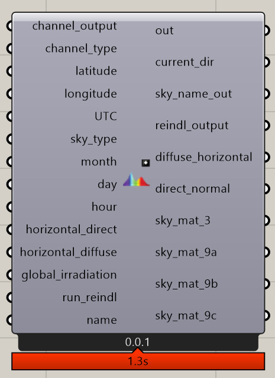
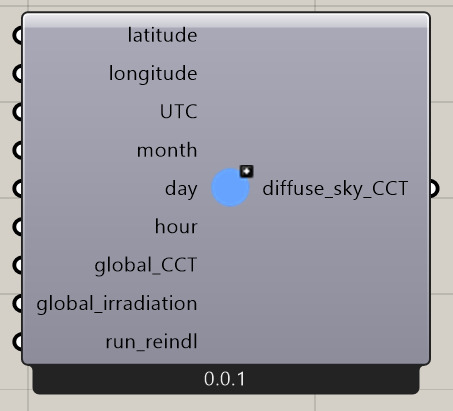
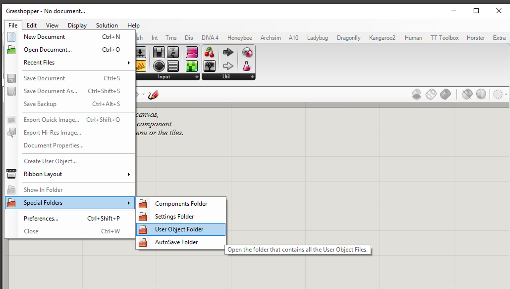
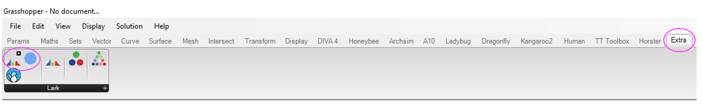

# Lark spectral lighting updates

Grasshopper components (user objects) that enables using [Lark](https://faculty.washington.edu/inanici/Lark/Lark_home_page.html) with gendaylit sky and weighted sky colour temperature when using global spectral irradiance.

## Terms of use

Updates to Lark (the spectral lighting workflow in grasshopper) is based on the published conference paper *Spectral Rendering with Daylight: A Comparison of Two Spectral Daylight Simulation Platforms* and my PhD dissertation *Measuring and Modelling Equatorial Light*. Kindly cite either the paper or dissertation when using the components.

```
@INPROCEEDINGS{balakrishnanSpectral2019,
    author  = "Balakrishnan, Priji and Jakubiec, J Alstan",
    title   = "Spectral Rendering with Daylight: A Comparison of Two Spectral Daylight Simulation Platforms",
    booktitle = "Proceedings of Building Simulation 2019: 16th Conference of IBPSA",
    year      = "2019",
    editor    = "V. Corrado, E. Fabrizio, A. Gasparella, and F. Patuzzi",
    address   = "Rome",
    month     = "sep"
}
```

```
@phdthesis{balakrishnan2019,
    author  = "Balakrishnan, Priji",
    title   = "Measuring and Modelling Equatorial Light",
    school  = "Singapore University of Technology and Design",
    year    = "2019",
    address = "8 Somapah Rd, Singapore 487372",
    month   = "jan"
}
```

## Grasshopper Components

1. `Build Gendaylit Spectral Radiance Sky Definitions.ghuser`: this grasshopper user object is build on the original Lark component *Build Spectral Radiance Sky Definitions* but replaces the gensky with gendaylit sky definition.



2. `Diffuse Sky Correlated Color Temperature.ghuser`: this grasshopper user object helps generate a weighted Correlated Color Temperature (CCT) for a diffuse sky from a measured Global CCT that includes the sun and sky. For a clear sky scenario, Lark adds the *sun* to the generated *sky*. This component helps to compensate for the added sun when using measured global CCT. Use the generated diffuse sky CCT as an input in the [Rochester Institute of Technology's excel daylight series calculator](https://www.rit.edu/cos/colorscience/rc_useful_data.php) to generate Spectral Power Distribution (spd) input for Lark.




## How to use

Download Lark prior to installing the user objects and then follow the steps below:

1. Download both the grasshopper `.ghuser` file from Github.

2. Copy them to the Grasshopper `User Objects` folder.



3. The grasshopper user objects should appear under `Extra`-the tab that contains the Lark components.


